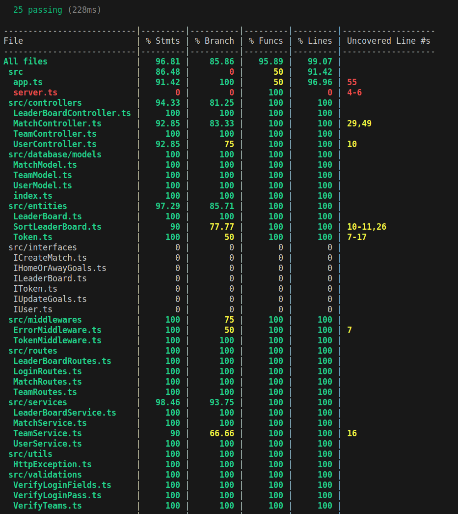

<h1 align="center">Boas-vindas ao repositório do Trybe Futebol Clube!</h1>

<h2 align="center">
  <a href="https://trybe-fc.up.railway.app/doc" target="_blank">
    Swagger
  </a>
</h2>
<br/>

## Objetivo

O <strong>Trybe Futebol Clube</strong> é um site informativo que fornece informações sobre partidas e classificações de futebol. Durante o desenvolvimento, foi criada uma API que se comunica com o front-end, permitindo adicionar uma partida após a validação de um token.

## O que foi desenvolvido?

<strong>Trybe Futebol Clube</strong> é um projeto que fornece informações sobre um campeonato de futebol. Ele inclui um front-end pré-disponibilizado que permite realizar login e gerar um token.

A API é capaz de acessar o banco de dados e retornar informações sobre todos os times, ou somente um time específico por meio do seu ID. Além disso, ela retorna informações sobre todas as partidas ou apenas as partidas em andamento ou finalizadas. A API possui endpoints para criar partidas em andamento, atualizar o placar e o status de progresso, e filtrar a classificação geral do campeonato, bem como a classificação dos times jogando em casa ou como visitantes.

Para criar a aplicação, foi utilizado o Docker para criar três containers, sendo dois para o ambiente preparado para o Node.js (um para o front-end e outro para o back-end) e um terceiro para o banco de dados MySQL. A aplicação foi escrita com o TypeScript e o Express.js para gerenciar rotas, tratar requisições HTTP e definir middlewares. O JWT foi usado para autenticar o token durante as requisições, e a biblioteca Sequelize foi utilizada como ORM para abstrair operações do MySQL.

Para a implementação de testes de integração, foram utilizadas as bibliotecas Mocha, Chai e Sinon, com uma cobertura de testes de aproximadamente 90% da aplicação back-end.

## Linguagens e ferramentas:
- Docker
- Node.js
- Typescript
- Express.js
- JWT
- PostgreSQL
- Sequelize
- Mocha
- Chai
- Sinon

## Instalação e execução com Docker:

### 1 - Clone o repositório:
```
git clone git@github.com:h3zord/trybe-futebol-clube.git
```

### 2 - Entre no repositório:
```
cd trybe-futebol-clube/app
```

### 3 - Inicie os containers:
```
docker compose up -d --build
```

<strong>O container app_frontend vai executar o node na porta 3000, o container app_backend na porta 3001 e o banco de dados na porta 5432.</strong>
<br/>
➜ http://localhost:3000/
<br/>
➜ http://localhost:3001/

<br/>

## Endpoints

### - Login
#### Método post:
- /login ➜ Realiza o login com email e senha e em seguida gera um token.

#### Método get:
- /login/validate ➜ Verifica qual é o tipo de usuário.

<br/>

### - Team
#### Método get:
- /teams ➜ Lista todos os times.
- /teams/:id ➜ Busca uma time pelo seu ID.

<br/>

### - Match
#### Método post:
- /matches ➜ Cadastrar uma nova partida.

#### Método get:
- /matches ➜ Lista todas as partidas, apenas as finalizadas ou que estão em andamento.

#### Método patch:
- /matches/:id/finish ➜ Atualiza o status de uma partida em andamento para finalizada.
- /matches/:id ➜ Atualiza o placar da partida. 

<br/>

### - LeaderBoard
#### Método get:
- /leaderboard ➜ Lista a classificação geral do campeonato.
- /leaderboard/home ➜ Lista a classificação dos times como mandante no campeonato.
- /leaderboard/away ➜ Lista a classificação dos times como visitante no campeonato.

<br/>

## Execução dos testes

### 1 - Entre no container do node back-end:
```
docker exec -it app_backend sh
```
### 2 - Rode o script:
```
npm run test:coverage
```

<h2 align="center">Cobertura de testes</h2>
<br />

<div align="center">
  
</div>
<br />